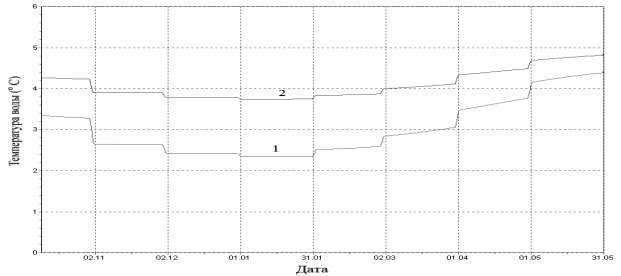

Эта статья создана с помощью RMarkdown и содержит примеры исследований, в которых используется описательный, либо прогностический анализ. Для каждого вида анализа приведено два примера исследований.

Рассмотрены ключевые признаки для каждого анализа, а также причины использования конкретного типа анализа в приведенных исследованиях.

## Описательный анализ

**Цель** описательного анализа заключается в том, чтобы обобщить или описать некоторый набор данных.
В случае описательного анализа, выводы, полученные для анализируемой выборки данных, не могут быть применены к более генеральной совокупности данных.

#### Признаки описательного анализа
Отличительными признаками описательного анализа являются:
 
1.    Анализ новых полученных данных;
2.    Описание исследуемых объектов и их измерений;
3.    Изучение отдельно взятой выборки, не распространяясь на генеральную совокупность; 
4.    Использование средних мер для выборки, в частности:
   *   Мода;
   *   Медиана;
   *   Среднее;
   *   Среднее гармоническое;
   *   Среднее геометрическое.
5.    Использование мер рассеивания:
   *   Минимум;
   *   Максимум;
   *   Квартили;
   *   Дисперсия;
   *   Процентили;
   *   Стандартная ошибка;
   *   Межквартильный размах;
   *   Стандартное отклонение.
6.    Использования мер формы:   
   *   Коэффициент эксцесса;
   *   Коэффициент асимметрии.
          
#### Описательный анализ в исследованиях

Многие исследования включают описательный анализ как начальный этап анализа данных, для выявления интересных или аномальных показателей, которые будут исследоваться в дальнейшем. 

Так, в своей статье [Личностные особенности студенток с различной структурой самоотношения](https://cyberleninka.ru/article/n/lichnostnye-osobennosti-studentok-s-razlichnoy-strukturoy-samootnosheniya) @Ch использует описательный анализ данных, полученных после тестирования  157 студенток. 

В статье описаны методы тестирования и их измерения, обобщены личные признаки студенток, а также критерии их разделения на 4 группы. 

В качестве данных, в первую очередь, используются **средние** показатели по каждому из тестов для 4 групп студенток. Эти средние сравниваются между собой, вычисляются **различия** между показателями. На их основе выдвигаются предположения, относительно значимости как самих средних показателей, так и их различий между группами.

В заключении статьи выдвигается предположение относительно исследуемых признаков, а также автор информирует о том, что полученные для данной выборки знания не могут быть наложены на генеральную совокупность, что в свою очередь является основой для дальнейших исследований.

Так, в другой статье под названием [Состояние копытец КРС в разные возрастные периоды и анализ причин их поражения](https://cyberleninka.ru/article/n/sostoyanie-kopytets-krs-v-raznye-vozrastnye-periody-i-analiz-prichin-ih-porazheniya/viewer) @BIU исследует заболевания копытец коров. Данные были получены для коров на фермах и хозяйствах Рязанской области. Автор описывает особенности объектов и их исследуемые измерения, разделяет их на группы по возрастному критерию и приводит процентные соотношения повреждений копытец для каждой группы. Вычисления проводятся и для подгрупп, разделенных по отелу.

Для анализа используются средние показатели для каждой группы, проводится сравнение показателей и строятся предположения о зависимости повреждений от других факторов. В качестве вывода @BIU полагает, что существуют другие причины поражений копытец и неучтенные факторы, которые могут быть исследованы в дальнейшем.

Не смотря на то, что обе статьи описывают достаточно серьезные исследования, сами исследования не дают никаких конечных положений по отношению к предмету исследования в целом. Недостаток данных и неучтенные параметры позволяют сделать только предположения о предмете исследования и подготовить данные для дальнейших изучений, что указывает на использование описательного анализа при исследовании. 

## Прогностический анализ

Для прогностического анализа **целью** является использование существующих и исторических данных для построения прогностической модели, прогнозирования будущих данных.

#### Признаки прогностического анализа

Необходимость прогноза обусловлена желанием знать события будущего, что достоверно — невозможно в принципе, исходя из статистических, вероятностных, эмпирических, философских принципов.

Любой прогноз имеет точность, использует определенные методы и классифицируется по одному или нескольким признакам - Таблица 1.

***Таблица 1.*** *Характеристики прогноза*

| Методы          |Классификация|Точность                   |
|:----------------|:------------|:--------------------------|
|Интуитивные      |Сроки        |Модели                     |
|Моделирование    |Масштабы     |Методики                   |
|Статистические   |Авторство    |Свойства объекта прогноза  |
|Экспертная оценка|             |Объем и актуальность данных|

#### Прогностический анализ в исследованиях

В своем исследовании @P2 используют прогностический анализ, для определения характера изменений воды, а также ледотермичкого режима и минерализации, после постройки высоконапорной гэс на одном из участков.

Исследование проводится на основе имеющихся данных о температуре, качестве и замерзании воды на разных участках реки, на которых планируется построить плотину. На их основе расчитываются будущие значения этих показателей и строится прогноз.

При прогнозировании исследователи используют статистические методы расчета показателей и моделирование изучаемых локальных процессов. Прогноз составлен при учете заполняемости водохранилища для каждого учатска. 

Таким образом, в этом исследовании необходимо прогнозирование характера изменений признаков, чтобы выбрать наилучшее место для постройки плотины, при котором изменения будут незначительны, либо положительны.

В еще одной статье, посвященной исследованию исчерпаемости невосполняемых ресурсов, прогнозирование является лучшим методом для построения модели потребления этих ресурсов таким образом, чтобы срок исчерпания был достаточно большим. Автор статьи -- @P1 говорит:

>В данной работе приводятся количественные данные об энергетическом потенциале и динамике исчерпания традиционных углеводородов и природного урана, полученные на основе современных геологических данных о ресурсах и темпах роста их годовой добычи. 

Как и при описательном анализе, автор раскрывает характеристики изучаемых объектов и их измерений, после чего приступает к расчетам, на основе имеющихся данных. Для расчета периода полного исчерпания ресурса, измеряемого в годах, используется следующая формула: 

$$\frac{R}{P} - ratio \equiv \frac{M}{G~о~} \equiv  T~o~ $$
После получения расчетных данных моделируется динамика исчерпания, и на основе полученной модели строится прогноз исчерпания для каждого исследуемого объекта, позволяющий утверждать о сроках исчерпания того или иного ресурса, либо составить план по уменьшению/прекращению его добычи.

Статья опубликована на [GitHub](https://github.com/JuliyaOwer/Rrepo)

## Список источников